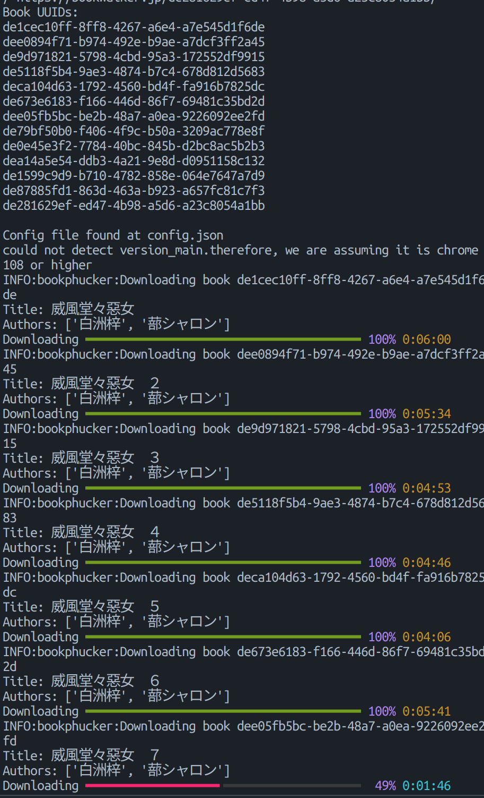

# Unpolished bookwalker.jp scraper

> It just works. -- Todd Howard

## TODO List

- [ ] Image `EPUB` export
- [ ] `OCR` integration
  - [ ] OCR text `EPUB` export
  - [ ] OCR to database

## Usage

### Installation

Requires Chrome/Chromium to be installed. For Chromium, you need to modify `"browser"` in `config.json` to `"chromium"`.

```bash
pip install -U poetry
cd fuckBookWalker
poetry install
```

### Running

```bash
poetry run python bookphucker <url or uuid of books>
```

You should see something like this.


By default, `bookphucker` will try to reuse previous `cookies`, using `--no-cache` to clear `cookies`.

## Common Issues

### Cannot log in

You may encounter CAPTCHA during the login process.

`bookphucker` will ask you to use non-headless mode to pass the captcha if your config sets `headless` to `true`.
